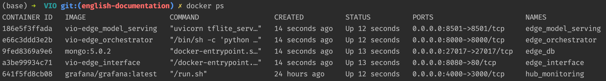
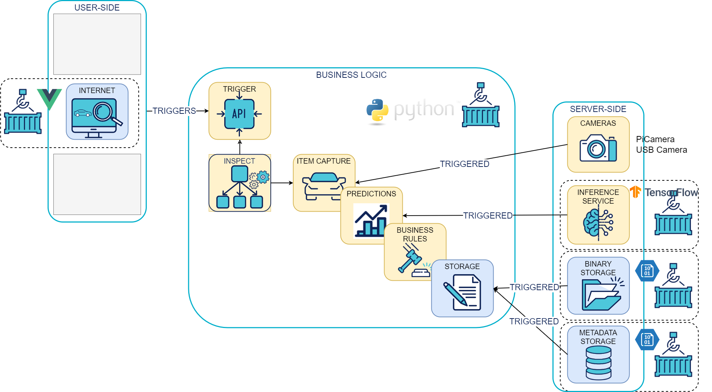

<div align="center">
    <h1>VIO - Visual Inspection Orchestrator</h1>


🎥 Visual Inspection Orchestrator is a modular framework made to ease the deployment of VI usecases 🎥

*Usecase example: Quality check of a product manufactured on an assembly line.*
</div>

<h1></h1>

## 🏗️ Modular framework

The VIO modules are split between:

**vio-edge modules**: The VIO edge modules are deployed close to the object to inspect

- [The edge orchestrator](docs/edge_orchestrator.md)
- [The edge interface](docs/edge_interface.md)
- [The edge model serving](docs/edge_model_serving.md)
- [The edge deployment playbook](docs/edge_deployment.md)

**vio-hub modules**: The VIO hub modules are deployed in the cloud to collect data and orchestrate the edge fleet

- [The hub monitoring](docs/hub_monitoring.md)
- [The hub deployment playbook](docs/hub_deployment.md)

**VIO full documentation can be found [here](https://octo-technology.github.io/VIO/)**

## 🧱 Requirements

- `docker` installed
- `make` installed

## 🚀 Getting started

### Install the framework

```shell
git clone git@github.com:octo-technology/VIO.git
```

### Running the stack

To launch the stack you can use the [Makefile](../Makefile) on the root of the repository which define the different
target based on the [docker-compose.yml](../docker-compose.yml) as described below, or [run the modules locally]().

#### Start vio

To start all edge services (orchestrator, model-serving, interface, db) with local hub monitoring (grafana):

```shell
make vio-edge-up
```

#### Stop vio

To stop and delete all running services :

```shell
make vio-edge-down
```

To check all services are up and running you can run the command `docker ps`, you should see something like below:



### Accessing the services 

Once all services are up and running you can access:

- the swagger of the edge orchestrator API (OrchestratoAPI): [http://localhost:8000/docs](http://localhost:8000/docs)
- the swagger of the edge model serving: [http://localhost:8501/docs](http://localhost:8501/docs)
- the hub monitoring: [http://localhost:4000/login](http://localhost:4000/login)
- the edge interface: [http://localhost:8080](http://localhost:8080)

From the edge interface you can load a configuration and run the trigger button that will trigger the Core API and
launch the following actions:



## 🛰️ Technology features
- 🏠 Hosting possibilities :
  - ☁️ Cloud possibilities with [Azure](https://portal.azure.com/#home) and [GCP](https://cloud.google.com/)
  - 👮 Float management with [Ansible](https://docs.ansible.com/ansible/latest/index.html)
  - 🛸 Raspberry deployment
  - 🐳 [Docker](https://www.docker.com/) Compose
  - 💻 Local
- ⚡️Backend API with [FastAPI](https://fastapi.tiangolo.com/)
- 📜 Frontend with [React](https://react.dev/)
- 🏭 Continuous Integration & Continuous Development : 
  - ♟️ Github actions
  - 📝️ Clean code with [Black](https://black.readthedocs.io/en/stable/index.html) & [Flake8](https://flake8.pycqa.org/en/latest/) 
  - ✅ Tested with [Pytest](https://docs.pytest.org/en/8.0.x/)
- 📈 [Grafana](https://grafana.com/) insight & dashboard

## 🏭 Releases

 Build Type        | Status                                                                                                                                                                                                    | Artifacts                                                           
-------------------|-----------------------------------------------------------------------------------------------------------------------------------------------------------------------------------------------------------|---------------------------------------------------------------------
 **Docker images** | [](https://github.com/octo-technology/VIO/actions/workflows/publication_vio_images.yml/badge.svg) | [Github registry](https://github.com/orgs/octo-technology/packages) 

## 📝 License

VIO is licensed under [Apache 2.0 License](docs/LICENSE.md)

## 🙋 Contributing

Learn more about how to get involved on [CONTRIBUTING.md](docs/CONTRIBUTING.md) guide
