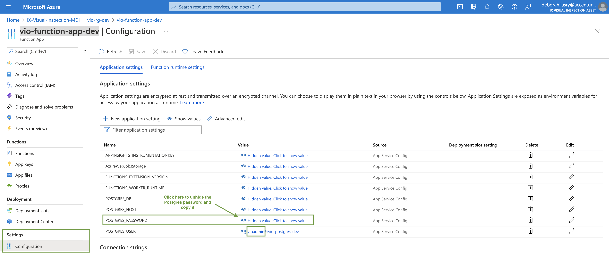

# Hub Deployment

The VIO hub modules can be deployed in any cloud, for this tutorial we decided to use Azure and its IoT solution Azure IoT Edge/Hub

This section allows you to create all the Azure infrastructure for VIO:
- Storage resources (Storage Account + PostgreSQL)
- The IoT Hub
- An Azure function (`telemetry_saver`) to save Device-to-Cloud telemetry data in PostgreSQL
- An Event Grid Topic to connect IoT Hub with the `telemetry_saver` Azure function

### Prerequisites

Before getting started, you need to install Ansible and its dependencies for Azure and PostgreSQL.

```shell
$ cd ./deployment/
$ conda create -n ansible python=3
$ conda activate ansible
$ pip install -r requirements.txt
$ ansible-galaxy collection install azure.azcollection
$ ansible-galaxy collection install community.grafana
```


You'll also need :
- The [Azure CLI](https://docs.microsoft.com/fr-fr/cli/azure/install-azure-cli)
- The [Azure CLI IoT extension](https://github.com/Azure/azure-iot-cli-extension) extension
- The [Azure Functions Core Tools](https://github.com/Azure/azure-functions-core-tools)

On MacOS, these can be installed as follows:

```shell
$ brew update
$ brew install azure-cli
$ az extension add --name azure-iot
$ brew tap azure/functions
$ brew install azure-functions-core-tools@3
```

Once you have installed `azure-cli`, you can login to Azure using your Accenture account:

```shell
$ az login
```

Make sure you are using the Azure subscription `IX-Visual-Inspection-MDI`. You can check that with:
```shell
$ az account list --output table
```

If `IX-Visual-Inspection-MDI` is not the default subscription, you can switch to it with the following command:
```shell
$ az account set --subscription "IX-Visual-Inspection-MDI"
```

### Define the mandatory environment variables

In order to create and configure all the Azure infrastructure, we need to define some environment variables: 

```shell
$ export REGISTRY_USERNAME=<your_gitlab_username>
$ export REGISTRY_PASSWORD=<your_gitlab_container_registry_token>
$ export POSTGRES_USERNAME=<postgres_admin_username>
$ export POSTGRES_PASSWORD=<postgres_admin_password>
$ export AZURE_STORAGE_CONNECTION_STRING=<azure_storage_connection_string>
```

#### Registry Username 
firstname.lastname (i.e nicolas.dupont)

#### Registry Password 
You can find it on gitlab, click on your profil picture (top right corner) --> preferences. 
On the ```Access Tokens``` category, you can generate a token. I suggest no expiration date, and you select all the scopes.
Keep this token safe, once it's generated you cannot retrieve it on gitlab anymore.

#### Postgres Username and Password.
- To Get the Postgres username, go the Azure Portal, our subscription ```IX-Visual-Inspection-MDI``` --> our resource group ```vio-rg-dev``` --> the ``` vio-function-app-dev ``` function app.
On the left side bar menu, click on ```Configuration``` and unhide the POSTGRES_USER field. You only need what's before the @. Here it's ```vioadmin```
- To Ge the Postgres password, it's on the same page but unhide the POSTGRES_PASSWORD field.




### Create Azure Infrastructure

The following command creates all the Azure IoT infrastructure for VIO.

```shell
$ ansible-playbook ansible/create_azure_cloud_infrastructure.yml -e 'ansible_python_interpreter=<path_to_your_conda_env_python_interpreter>'
```

### Deploy hub monitoring (grafana)

To deploy Grafana [dashboard](../monitoring/dashboards) and [data-sources](../monitoring/provisioning), run the following playbook :
```shell
$ ansible-playbook -i ansible/inventory/production.ini ansible/update_grafana_dashboard.yml --ask-pass
```

This will copy the files on the Grafana resource deployed in Azure and relaunch the grafana service to take into account the brand uploaded files. 
