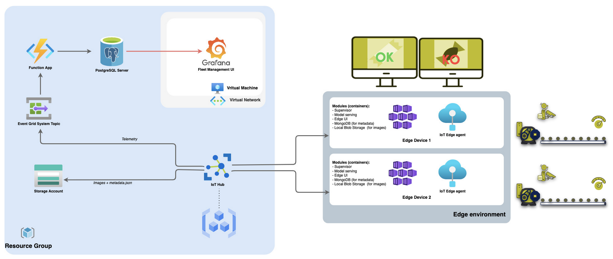

# Getting Started

Visual Inspection Orchestrator is a modular open source framework made to ease the deployment of VI usecases, initiated by Octo Technology.

*Usecase example: Quality check of a product manufactured on an assembly line.*

The VIO modules are split between:

** vio-edge modules **: The VIO edge modules are deployed close to the object to inspect

- [The edge orchestrator](edge_orchestrator.md)
- [The edge interface](edge_interface.md)
- [The edge model serving](edge_model_serving.md)
- [The edge deployment playbook](edge_deployment.md)

** vio-hub modules **: The VIO hub modules are deployed in the cloud to collect data and orchestrate the edge fleet

- [The hub monitoring](hub_monitoring.md)
- [The hub deployment playbook](hub_deployment.md)

## Install the framework

To launch the complete stack, you'll need a minima docker install on your machine.

`git clone git@github.com:octo-technology/VIO.git`

Note: The VIO docker images are available [here](https://github.com/orgs/octo-technology/packages?repo_name=VIO)

## Run the stack

To launch the stack you can use the [Makefile](https://github.com/octo-technology/VIO/blob/main/Makefile) on the root of the repository which define the different target based on the [docker-compose.yml](https://github.com/octo-technology/VIO/blob/main/docker-compose.yml):

- run all edge services (orchestrator, model-serving, interface, db) with local hub monitoring (grafana): `make vio-edge-up`
- stop and delete all running services: `make vio-edge-down`

In case you want to run a specific module, each module has its own make command:

- run the edge_orchestrator containerized: `make edge_orchestrator`
- run the edge model serving containerized: `make edge_model_serving`
- run the edge interface containerized: `make edge_interface`

Indeed each of the above target correspond to a command [docker-compose.yml](https://github.com/octo-technology/VIO/blob/main/docker-compose.yml). For example, the target `edge_orchestrator` correspond to :

```shell
$ docker compose up -d --build edge_orchestrator
```

To check all services are up and running you can run the command `docker ps`, you should see something like below:


Once all services are up and running you can access:

- the swagger of the edge orchestrator API (OrchestratoAPI): [http://localhost:8000/docs](http://localhost:8000/docs)
- the swagger of the edge model serving: [http://localhost:8501/docs](http://localhost:8501/docs)
- the hub monitoring: [http://localhost:4000/login](http://localhost:4000/login)
- the edge interface: [http://localhost:8080](http://localhost:8080)

From the [edge interface](edge_interface.md) you can load a configuration and run the trigger button that will trigger the Orchestrator API and launch the following actions:

 

## Implementation example

Here you can find an implementation of VIO deployed on Azure (vio-hub) managing a fleet of Raspberrys (vio-edge):
 
 
