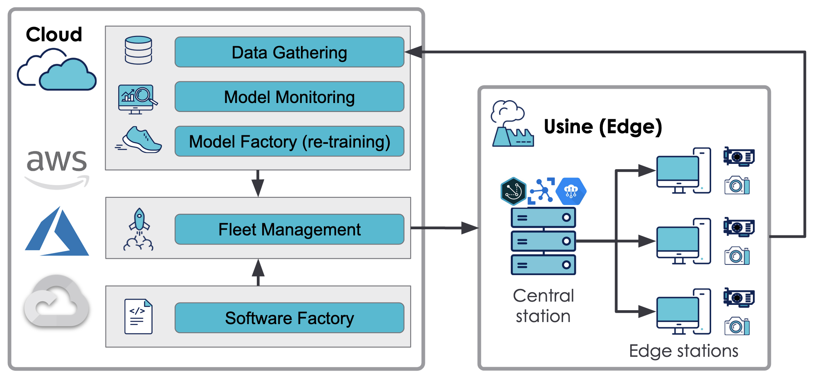
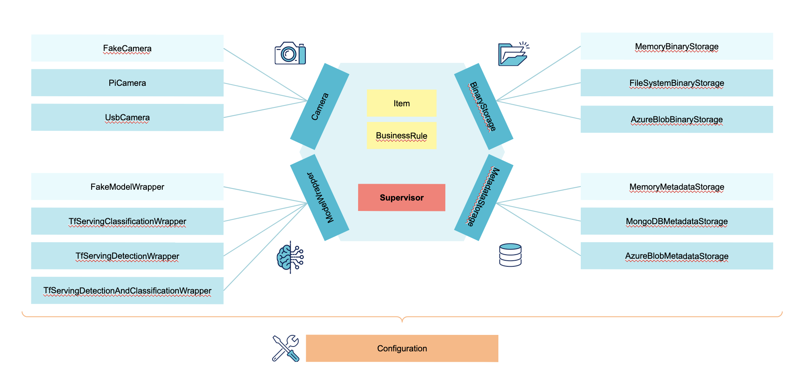

# Visual Inspection Orchestrator

Visual Inspection Orchestrator is a modular framework made to ease the deployment of VI usecases.

Usecase example: Quality check of a product manufactured on an assembly line.

## Context

### An MLOPS framework

VIO framework propose a generic code base for each of the following MLOPS features:

- The data gathering
- The model monitoring
- The model factory
- The fleet management
- The software factory

 
 
### A modular framework

VIO core has been built following the hexagonal architecture patterns, therefore it can be adapted to its production environement constraints (cloud provider, hardware, ML framework...).



### Micro-services approach

Each sub folders below are indeed a module, an application, an independant micro service. Anyone of them is therefore functional by itself.
Les sous-dossiers du dossier courant, à savoir :

- [le core de l'orchestration](supervisor.md) 
- [les outils de déploiement](deployment.md)
- [le monitoring de la flotte](monitoring.md)
- [l'interface à l'edge](edge_interface.md)
- [l'instance de serving de modèles](model_serving.md)

All of those modules have been packages inside a dedicated docker images to facilitate their deployment.

## Implementation example

Here you can find an implementation of VIO deployed on Azure managing a fleet of Raspberrys:
 
 


## Usage

To launch the complete stack, you'll need a minima docker install on your machine.

### Run the stack thanks to the Makefile

To launch the stack you can use the [Makefile](../Makefile) on the root of the repository which define the different target based on the [docker-compose.yml](../docker-compose.yml):

- 
- run all services (supervisor, model-serving, Mongo DB, UI) : `make services-up`
- run the core (supervisor) containerized : `make supervisor`
- run the model serving containerized: `make model_serving`
- run the edge interface containerized : `make ui`
- stop and delete all running services : `make services-down`

Each of the above target correspond to a command [docker-compose.yml](../docker-compose.yml). For example, the target `supervisor` correspond to :

```shell
$ docker-compose up -d --build supervisor
```


### Run the stack thanks to docker-compose commands

This command will lauch all services mentionned in the [docker-compose.yml](../docker-compose.yml). 

```shell
$ docker-compose up -d --build
```

Then you can stop all running services with the bellowing command (the containers will be stopped and deleted):

```shell
$ docker-compose down
```
