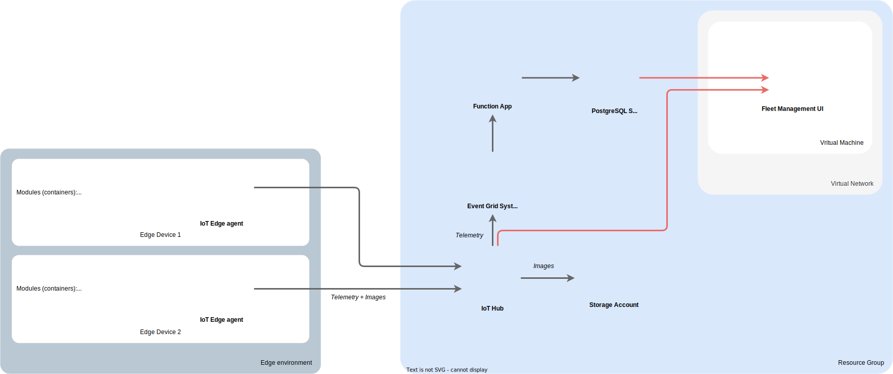

### MLOPS framework

VIO framework propose a generic code base for each of the following MLOPS features:

- The data gathering
- The model monitoring
- The model factory
- The fleet management
- The software factory

 
 
### Modular framework

VIO core has been built following the hexagonal architecture patterns, therefore it can be adapted to its production environement constraints (cloud provider, hardware, ML framework...).

### Micro-services approach

Each sub folders below are indeed a module, an application, an independant micro service. Anyone of them is therefore functional by itself.

### vio-edge modules
- [The edge orchestrator](vio-edge/edge_orchestrator.md)
- [The edge interface](vio-edge/edge_interface.md)
- [The edge model serving](vio-edge/edge_model_serving.md)
- [The edge deployment playbook](vio-edge/edge_deployment.md)

### vio-hub modules
- [The hub monitoring](vio-hub/hub_monitoring.md)
- [The hub deployment playbook](vio-hub/hub_deployment.md)

All of those modules have been packages inside a dedicated docker images to facilitate their deployment.

## Cloud agnostic

### VIO hub deployed on azure

### VIO hub deployed on GCP

### VIO hub deployed on AWS

