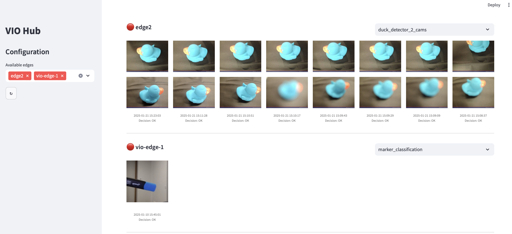

# 📺 Hub streamlit 



The hub is a streamlit app allowing you to visualize data generated by a VIO project in its cloud storage. 
It can be used to monitor the activity of a fleet of VIO edges in real time to see the captured images, predictions and 
business decision.
Currently running with GoogleCloudPlatform only.

### 🛠️ Configuring .env file 
Copy the .env.template file with the necessary information.
- `BUCKET_NAME` is the name of the bucket where the data is stored.
- `GOOGLE_APPLICATION_CREDENTIALS` is the path to the json file with the credentials to access the bucket. **Default path** is `config/secrets/credentials.json`

### 🏃 Starting the hub 
Run the following commands in the terminal in the hub_streamlit directory:
```bash
    make env 
    make run
```
