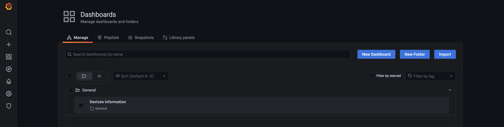
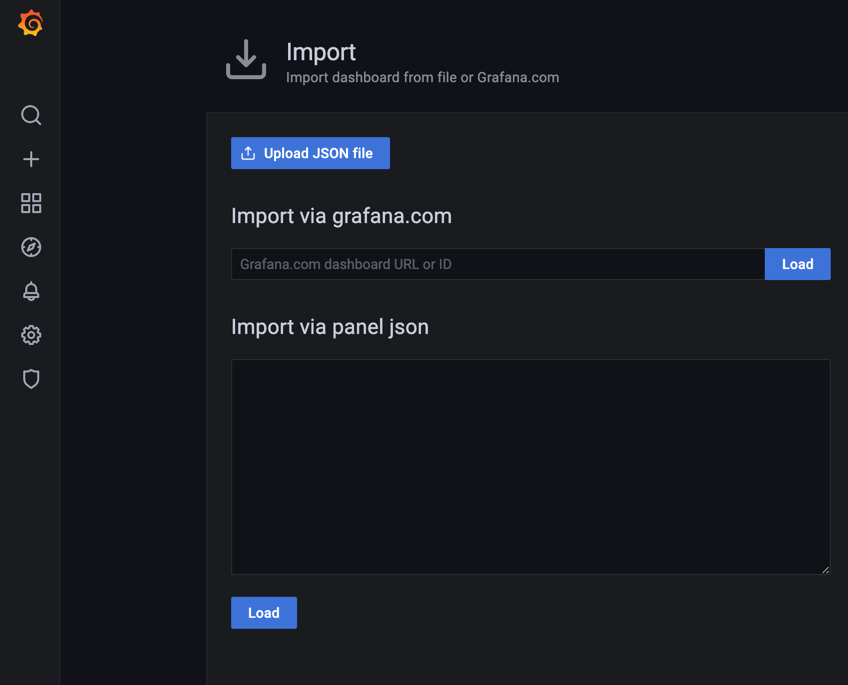
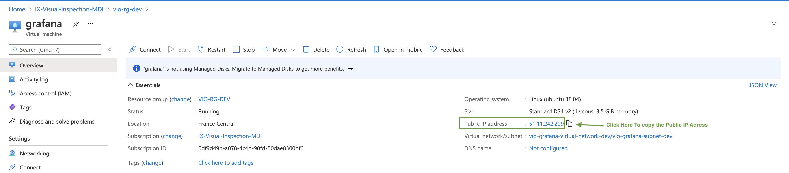

# Monitoring 

[[_TOC_]]

The monitoring is here to help us monitor our IoTHub Devices and Modules via a Grafana dashboard.
## Files 

### Dashboards

Once you've created a dashboard in Grafana you can export it in JSON and then save it in the ```monitoring/dashboard ```folder. 
This manipulation allows you to save your dashboard and visualize it when you deploy your Grafana.
- In Grafana, you can directly export your dashboard via the JSON file. To do this, you open your Grafana, then go to Dashboards/Manage and then click on Import
and import your JSON file.
  
Manage Dashboards: 



To import a dashboard from a JSON file : 



### Provisioning

#### Dashboards
You can manage dashboards in Grafana by adding one or more YAML config files in the provisioning/dashboards directory. Each config file can contain a list of dashboards providers that load dashboards into Grafana from the local filesystem.
When Grafana starts, it will update/insert all dashboards available in the configured path

#### Datasources
It’s possible to manage data sources in Grafana by adding one or more YAML config files in the provisioning/datasources directory. Each config file can contain a list of datasources that will get added or updated during start up. If the data source already exists, then Grafana updates it to match the configuration file. The config file can also contain a list of data sources that should be deleted. That list is called deleteDatasources. Grafana will delete data sources listed in deleteDatasources before inserting/updating those in the datasource list.
Our datasources are protected by tokens. 
 - In order to get the iothub_metrics datasource token you must run the command : 
```az account get-access-token -s {subscription-id}``` in your terminal. 
   You will have a Bearer token that you need to pass into the field ```httpHeaderValue1``` in the yaml datasource file preceded by the keyword 'Bearer'
- In order to get the iothub_devices datasource token you must run the command : ``` az iot hub generate-sas-token -n {your-iothub-name} ``` in your terminal.
This command returns you a sas token that you need to copy in the field ```httpHeaderValue1``` in the yaml datasource file

## Deployment

### Deploy the Grafana in Azure

To deploy your Grafana on Azure, launch ``` make deploy-grafana-azure``` 
As our datasource tokens are only available for a short period of time (2h), you'll need to often redeploy the grafana (to have new tokens) or you'll face some authorization issues in the dashboard.  

## Access to Grafana 

The grafana dashboard is public. In order to access it you need its public IP address and its port.
The port is 3000.
To get the public IP address, to you must go to the Azure Portal --> our subscription ```IX-Visual-Inspection-MDI``` --> our resource group ```vio-rg-dev```
--> ```grafana``` (Virtual machine). You can copy the Public IP Address



To have access to the Grafana, you fill the address bar of your navigator with ```Public IP Adress:Port```.
Here it's [51.11.242.209:3000](http://51.11.242.209:3000)


